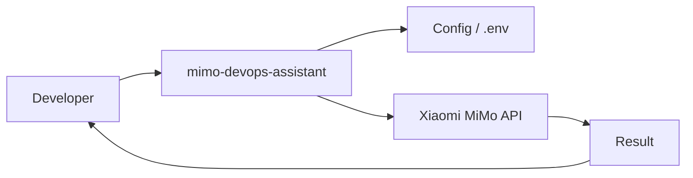

# Architecture

```mermaid
flowchart LR
  U[Developer] --> A[mimo-devops-assistant]
  A --> C[Config / .env]
  A --> M[Xiaomi MiMo API]
  M --> O[Result]
  O --> U
```

## Design
- Minimal dependencies
- API-key via environment variable only
- Safe examples, no real secrets
- Built for open-source developer workflows
